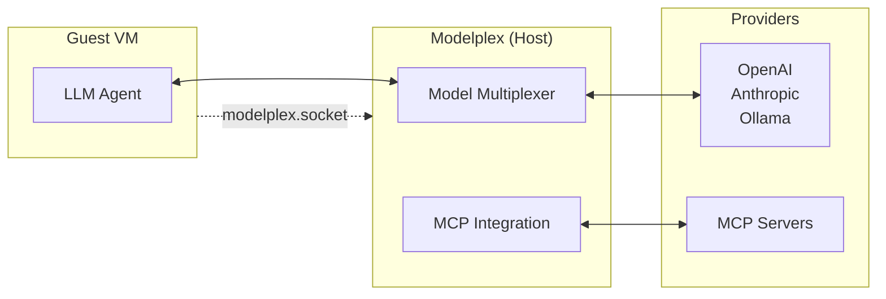

# Modelplex

Decouple models and MCP integrations from the agent.

**With modelplex, we can run AI agents in complete network isolation.** No outbound connections. Full AI capabilities.



## Features

**🔀 Model Multiplexer**
- Use any model through one OpenAI-compatible interface
- Manage API keys and secrets in modelplex, so your agent doesn't need to know about them.

**🌐 HTTP & Socket Support**
- HTTP server by default on port 11435 for easy testing and development
- Unix domain socket communication for secure, zero-network-dependency deployments
- Run agents in a VM without a network device when using socket mode

**📊 Full Observability**
- Structured logging with slog
- Monitor every AI interaction

## Quick Start

```bash
# Build from source
git clone https://github.com/shazow/modelplex.git
cd modelplex
go build -o modelplex ./cmd/modelplex
```

Create `config.toml`:

```toml
# Multi-provider configuration with failover
[[providers]]
name = "openai"
type = "openai"
base_url = "https://api.openai.com/v1"
api_key = "${OPENAI_API_KEY}"
models = ["gpt-4", "gpt-3.5-turbo"]
priority = 1

[mcp]
enabled = true
servers = [
    { name = "filesystem", command = "mcp-server-filesystem", args = ["/workspace"] },
]
```

### 3. Start Modelplex

```bash
# HTTP server (default - :11435)
./modelplex --config config.toml

# HTTP server on custom address
./modelplex --config config.toml --http "0.0.0.0:8080"

# HTTP server on custom port (localhost)
./modelplex --config config.toml --http ":8080"

# Socket mode for zero-network-dependency isolation
./modelplex --config config.toml --socket ./modelplex.socket

# Verbose logging
./modelplex --config config.toml --verbose
```

### 4. Connect with an agent

#### HTTP Mode (default)

```python
# Standard HTTP connection (Python)
import openai

client = openai.OpenAI(
    base_url="http://localhost:11435/models/v1",
    api_key="unused"  # Not needed, handled by modelplex
)

response = client.chat.completions.create(
    model="gpt-4",
    messages=[{"role": "user", "content": "Hello from HTTP!"}]
)

print(response.choices[0].message.content)
```

```bash
# HTTP mode (curl)
curl -X POST http://localhost:11435/models/v1/chat/completions \
  -H "Content-Type: application/json" \
  -d '{
    "model": "gpt-4",
    "messages": [{"role": "user", "content": "Hello!"}]
  }'
```

#### Socket Mode (for complete isolation)

```python
# Isolated agent environment (Python)
import openai

client = openai.OpenAI(
    base_url="unix:/path/to/modelplex.socket",
    api_key="unused"  # Not needed, handled by host
)

# Works exactly like normal OpenAI, but completely isolated
response = client.chat.completions.create(
    model="gpt-4",
    messages=[{"role": "user", "content": "Hello from isolation!"}]
)

print(response.choices[0].message.content)
```

```javascript
// HTTP mode (Node.js)
import OpenAI from 'openai';

const client = new OpenAI({
  baseURL: 'http://localhost:11435/models/v1',
  apiKey: 'unused'
});

const response = await client.chat.completions.create({
  model: 'claude-3-sonnet',
  messages: [{ role: 'user', content: 'Hello from HTTP!' }]
});
```

```javascript
// Socket mode (Node.js)
import OpenAI from 'openai';

const client = new OpenAI({
  baseURL: 'unix:/path/to/modelplex.socket',
  apiKey: 'unused'
});

const response = await client.chat.completions.create({
  model: 'claude-3-sonnet',
  messages: [{ role: 'user', content: 'Hello from isolation!' }]
});
```

```bash
# Socket mode (curl)
curl --unix-socket ./modelplex.socket \
  -X POST http://localhost/models/v1/chat/completions \
  -H "Content-Type: application/json" \
  -d '{
    "model": "gpt-4",
    "messages": [{"role": "user", "content": "Hello!"}]
  }'
```

## API Endpoints

Modelplex exposes several endpoint groups:

- **`/models/v1/*`** - OpenAI-compatible API endpoints
- **`/mcp/v1/*`** - Model Context Protocol endpoints
- **`/_internal/*`** - Internal management endpoints (HTTP mode only)
- **`/health`** - Health check endpoint

Internal endpoints are only available when running in HTTP mode, providing additional security in socket deployments.


## Docker

```bash
# Build
docker build -t modelplex .

# Run with HTTP server (default)
docker run -p 11435:11435 -v /path/to/config.toml:/config.toml modelplex

# Run with custom address
docker run -p 8080:8080 -v /path/to/config.toml:/config.toml modelplex --http ":8080"

# Run with socket
docker run -v /path/to/config.toml:/config.toml \
           -v /path/to/socket:/socket \
           modelplex --socket /socket/modelplex.socket
```

## License

MIT
